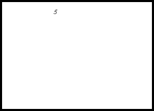

# Carmnist

This is just a start of a nice well-scoped project...

Namely, a simulator to create a video dataset of MNist digits floating by. The
purpose of this dataset is to benchmark video based traffic-sign detection and
tracking.

That is, small videos more or less like this:

